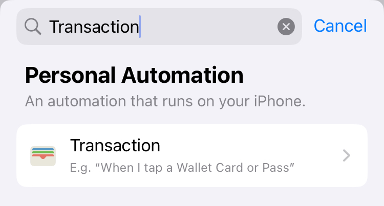
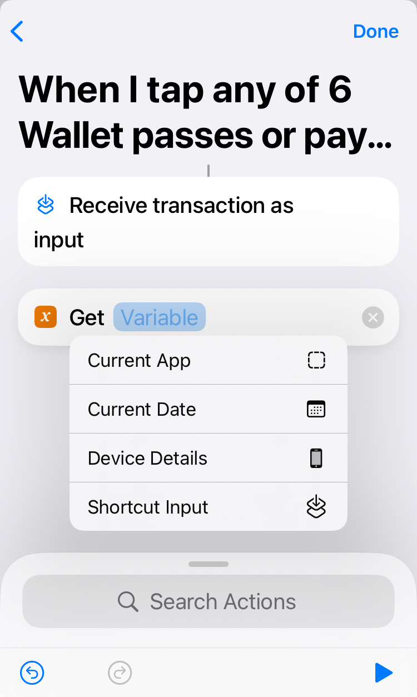
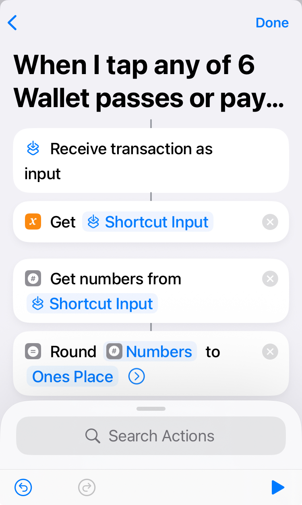
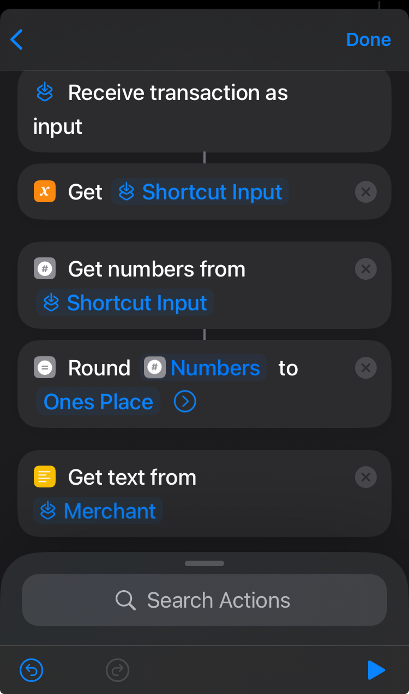
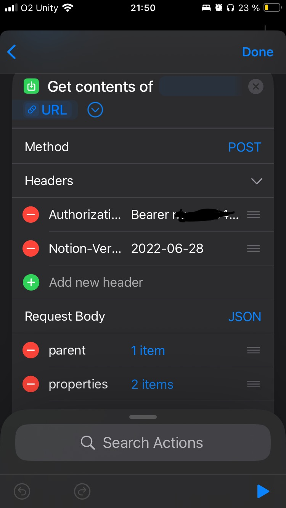

# applepay-notion-automation
Track ApplePay expenses in Notion using iOS Automation

# 💸 ApplePay to Notion: Automated Expense Tracker

This automation logs your ApplePay transactions (merchant + amount) directly into a Notion database. It's built using Apple's iOS Automations, Notion API, and text manipulation to handle different currency formatting.

## 🧩 What It Does

- Triggered by ApplePay transactions via iOS Shortcuts Automation
- Sends the transaction info as a new row to a Notion Expense Tracker database

## 🔧 Tools Used

- **iOS Shortcuts Automation** 
- **Notion API** – you’ll need an integration token
- **Custom JSON formatting**

## 🛡 Security and Customization

- DO NOT share your real Notion token or database ID.
- Screenshots in this repo are anonymized.
- This repo shows a basic set up. You'll want to customize it by adding more parameters (like Expense category, Date or Account)

## 🚀 How To Use This

1. **Set up your Notion database**:
   - Make sure it has at least “Name" and "Amount" columns. You can create more columns to customize it to your needs. 
   - later in the process you'll need the database ID: on the full page of your database, click on menu (three dots at the upper right-hand corner) > Copy link > paste it somewhere (you need to edit the link) - delete anything before the slash (including the slash) and after the question mark (incl. the question mark) - you'll end up with alphanumeric name of 32 characters

2. **Create a Notion integration**:
   - [https://www.notion.so/profile/integrations](https://www.notion.so/profile/integrations)
   - get Internal Integration Secret (do not share this with anyone) - you'll need it later

3. **Connect your Notion database with your Integration**:
   - on the full page of your database, click on menu (three dots at the upper right-hand corner) > Connections and search for the name of Integration you just created

3. **Create the iOS Automation** manually:
1) Trigger = Transaction [screenshot 1_Trigger]
2) Choose the card(s) you want to receive the expense from
3) In the next step click on New Blank Automation
4) On scripting tab search for "Get Variable" 
5) Tap on Variable and choose "Shortcut Input" from the menu [screenshot 2_GetVariable]
6) Add another action: "Get numbers from" - it should fill with "Shortcut Input" again
7) Add "Round numbers" - I chose to round the numbers to Ones place [screenshot 3_RoundNumbers]
8) Add "Get text from Input", click on "Input" and choose "Select Variable" - search for "Shortcut Input" and choose "Merchant" from the menu [screenshot 4_Merchant]
9) Add "URL" and fill: https://api.notion.com/v1/pages
10) Add "Get contents of URL"
Method = POST
Headers:
- Authorization: Bearer [your Integration Secret]
- Notion-Version: 2022-06-28
Request Body (JSON):
```json
{
  "parent": {
    "type": "database_id",
    "database_id": "DATABASE_ID"
   },
  "properties": {
    "Name": {
      "title": [
        {
          "text": {
            "content": "Merchant"
          }
        }
      ]
    },
    "Amount": {
      "number": "Rounded Number"  
    }
  }
}
```

- Replace the "Merchant" with "Shortcut Input" and search for "Merchant"
- "Rounded Number" is the variable you got from transaction's "Amount"
This block should look like this when done: [screenshot 5_GetContentsOfURL]


## 🖼 Screenshots of the Automation

| Step | Description | Screenshot |
|------|-------------|------------|
| 1 | ApplePay Trigger |  |
| 2 | Get Variable |  |
| 3 | Round Numbers from transaction |  |
| 4 | Get text from Merchant |  |
| 5 | Get contents of URL |  |

4. **Test a transaction** – Try using ApplePay and check your Notion!

## 🧠 Why I Built This

I wanted a real-time, low-effort and no-input-required way to track my personal spending.
